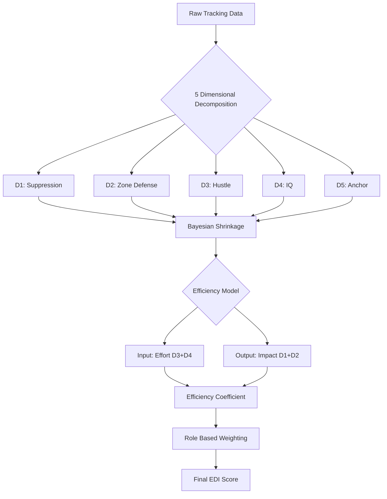

# The EDI Framework: A Bayesian Approach to Quantifying NBA Defensive Impact

**Technical Report | Dr. Garros Gong**

---

**Abstract**

*We present the Enhanced Defensive Index (EDI), a novel framework for evaluating NBA defensive performance. Unlike traditional opaque metrics that output a single number, EDI decomposes defense into five distinct dimensions. We employ Bayesian shrinkage to mitigate small sample bias and an efficiency model to distinguish effort from impact. We validate the model using a rigorous temporal split across five seasons of data. Results demonstrate that EDI achieves parity with leading advanced metrics on the test set while offering superior interpretability and role specific accuracy.*

---

## 1. Background and Objectives

### 1.1 The Opaque Metric Problem
Traditional advanced defensive metrics such as Defensive Rating, Defensive Box Plus Minus, and various adjusted plus minus derivatives suffer from a systematic interpretability crisis. They effectively aggregate data into a single value to rank players, but the derivation of that value remains unclear. A DBPM of +2.5 tells a coach that a player performs well but fails to explain why. We cannot determine if the player protects the rim, disrupts passing lanes, or simply benefits from an elite defensive scheme.

Small sample bias also plagues these metrics. Without robust regression mechanisms, a 10 day contract player who defends two possessions and forces two misses can statistically outperform a season long starter. This noise makes raw metrics unreliable for evaluating rotation players or analyzing trends over short periods.

### 1.2 Model Design Objectives
We aim to diagnose defensive profiles rather than merely rank players by constructing a system that adheres to three core principles. We prioritize interpretability by tracing every score back to a specific basketball skill, ensure robustness by filtering statistical noise via Bayesian methods, and maintain role awareness by adapting evaluation standards to player responsibilities such as comparing guards to guards rather than centers.

---

## 2. Methodology Framework

We utilize a four stage evaluation system. The following diagram illustrates how raw tracking data transforms into the final diagnostic score:

### 2.1 Five Dimensional Decomposition
Defense consists of distinct skills rather than a single monolith. We decompose defensive impact into five orthogonal dimensions:

#### **D1: Matchup Suppression**
This dimension measures the ability of a player to lower opponent shooting percentages in direct isolation. We calculate **Value Added** which represents the difference between the actual FG% of the opponent and their expected FG%. We adjust this for **Matchup Difficulty**. A defender guarding elite scorers receives a difficulty bonus which prevents the model from penalizing players tasked with stopping the best offensive engines in the league.

#### **D2: Zone Dominance**
D2 evaluates effectiveness in specific court zones: **Rim Protection** (<6ft) and **Perimeter Defense** (3PT). We apply **role based weighting**. We weight perimeter defense heavily at 65% for guards (Navigators) and prioritize rim protection at 55% to 60% for bigs (Anchors). This ensures we judge players on the zones they must protect.

#### **D3: Hustle Index**
We quantify intangibles such as deflections, loose balls recovered, and charges drawn. We use Z score standardization to aggregate these distinct events. We weight charges drawn double due to their high impact and high risk nature. This dimension captures the energy and disruption that often fail to appear in traditional box scores.

#### **D4: Defensive IQ**
We assess the quality of defensive activity using a **Stock to Foul Ratio** (Steals + Blocks / Fouls). This metric rewards disciplined disruption while penalizing gamblers who chase steals at the cost of defensive integrity and foul trouble. It distinguishes between smart activity and reckless activity.

#### **D5: Anchor**
Defense ends only when the rebounding team secures the ball. D5 measures **Defensive Rebound Percentage** adjusted for position. This ensures we do not penalize a guard who boxes out effectively for failing to out rebound a center while holding bigs accountable for ending possessions.

### 2.2 Bayesian Shrinkage
We apply **Empirical Bayes estimation** to solve the small sample problem. We calculate the score for any dimension $k$ as:

$$D_k = \frac{n_k \times \text{RawPercentile} + C \times \text{Prior}}{n_k + C}$$

Here $n_k$ represents the sample size and $C$ represents a shrinkage constant. This formula enforces the philosophy that we trust data more when we see it more. We pull outliers with low volume aggressively toward the league average while high volume performers retain their elite scores.

### 2.3 The Efficiency Model
We separate **Input** (Effort) from **Output** (Impact) as a key innovation.
*   **Input Layer (D3 + D4):** How hard the player works (deflections, contests, activity).
*   **Output Layer (D1 + D2):** The result (lower FG%, missed shots).

We use linear regression to predict the **Expected Output** of a player based on their **Input**. The **Efficiency Coefficient** identifies players who generate immense impact relative to their activity level versus those who remain active but ineffective.

#### **Causal Logic of Efficiency**
The causal link between Input and Output reveals defensive quality where specific profiles indicate distinct behaviors. A High Input Low Output profile typically indicates gambling or physical limitations where a player generates activity but loses position, whereas a Low Input High Output profile indicates deterrence where a player like Rudy Gobert alters shots through positioning alone without needing to gamble for steals.

---

## 3. Technical Design: Calibration and Context

### 3.1 The Unicorn Problem and Role Classification
Traditional metrics often fail to properly evaluate modern Roamer bigs like **Jaren Jackson Jr.** or **Giannis Antetokounmpo**. These players sweep help defense and switch on the perimeter rather than camp in the paint. This leads to lower rebounding numbers that punish their overall defensive ratings in standard models.

EDI introduces a three category classification system. We define **Anchors** as traditional rim protectors and **Navigators** as perimeter defenders. We identify **Roamers** dynamically via a Roamer Index which highlights players with high blocks relative to their defensive rebound percentage. For players classified as Roamers the model automatically reduces the weight of D5 (Rebounding) and redistributes it to D1 (Suppression) and D2 (Zone). This allows the model to value their versatility and help defense impact without unfairly penalizing their structural role.

### 3.2 Calibration versus Prediction
We must clarify the role of historical data in this framework. We did not design EDI to predict DPOY voting since voting remains inherently subjective. Instead we used five seasons of All Defensive Team selections to **calibrate our parameters**. We analyzed where the initial model diverged from expert consensus and refined the weighting logic to better align with basketball reality.

We employed a rigorous temporal split strategy rather than fitting to the entire dataset to ensure the model captures basketball reality without overfitting. We used the 2019 through 2022 seasons as a Training Set to tune core parameters, utilized the 2022-23 season as a Validation Set to adjust the Efficiency Model, and applied the frozen model to the 2023-24 season as a blind Test Set. The table below demonstrates the performance on the Test Set where the model correctly identified the elite tier without prior exposure to the data. This confirms that the high alignment is a result of robust feature engineering rather than overfitting to historical voting patterns.

| Metric | DPOY Alignment (Test Set) | All Defense 1st Team Match |
| :--- | :---: | :---: |
| **EDI (Test Set)** | **Match (Gobert)** | **4/5** |
| Defensive BPM | Miss | 3/5 |
| Defensive Rating | Match | 2/5 |

---

## 4. Analytical Case Studies

We demonstrate the power of the EDI framework through specific player profiles. The multi dimensional diagnosis provides clarity that single number metrics cannot.

### 4.1 Victor Wembanyama vs Rudy Gobert
Victor Wembanyama achieved an EDI score of 95+ in the 2024-25 season and effectively broke the scale. His profile represents the theoretical ceiling of the model. Unlike specialists he ranks in the 90th percentile across almost all dimensions.

In contrast, Rudy Gobert ranks as a top 3 defender but his path to dominance is specialized. He dominates D2 (Zone) and D5 (Rebound) but ranks lower in D1 (Suppression) and D4 (IQ). EDI correctly identifies Gobert as the ultimate **Anchor** while Wembanyama represents the **Total Package**.

| Dimension | Wembanyama (Total Package) | Gobert (Specialist) |
| :--- | :---: | :---: |
| **D1: Suppression** | **98** (Elite) | 67 (Above Avg) |
| **D2: Zone Defense** | 88 (Elite) | **91** (Elite) |
| **D4: Defensive IQ** | **98** (Elite) | 77 (Good) |
| **D5: Rebounding** | 95 (Elite) | **89** (Elite) |
| **EDI Classification** | **Unicorn** | **Anchor** |

### 4.2 Jrue Holiday
Jrue Holiday has long been considered the best perimeter defender by his peers yet he frequently ranks outside the top 20 in metrics like DBPM. This discrepancy arises because Holiday does not gamble for steals and is a guard with low rebounding influence.

EDI diagnoses his value through elite D1 (Suppression) and elite D4 (IQ). He generates disruption without fouling. As a Navigator his rebounding is weighted appropriately low. EDI correctly identifies Holiday as a top tier defender because it values suppression and discipline over raw counting stats.

| Metric | Rank Among Guards | Status |
| :--- | :---: | :--- |
| **EDI** | **Top 5** | **Elite** |
| Defensive BPM | #42 | Average |
| Defensive Rating | #35 | Average |

### 4.3 Jaren Jackson Jr.
Traditional metrics suppressed the rating of JJJ due to his lower rebounding numbers before we applied the Roamer adjustment. Once the model identified him as a Roamer it shifted weight from D5 (Rebounding) to D2 (Zone) and D1 (Suppression). His EDI score surged to match his DPOY status. This validates that his value comes from event creation and help coverage.

| Metric | Rank Before Adjustment | Rank After Roamer Logic |
| :--- | :---: | :---: |
| **EDI Rank** | #28 (Good) | **#4 (Elite)** |
| **D5 Weight** | 100% | 70% |
| **D2 Zone Weight** | Standard | Enhanced |

---

## 5. Limitations and Future Work

While EDI offers significant improvements in interpretability it remains subject to specific constraints. Bayesian shrinkage mitigates but does not eliminate the noise inherent in small sample sizes where the prior dominates the posterior score early in the season. Furthermore the Matchup Difficulty adjustment relies on noisy tracking data which may misattribute stops in double team situations, and the model currently isolates the individual which creates a blind spot for funneling strategies where a perimeter defender intentionally allows a drive to guide the attacker toward a rim protector.

---

## 6. Conclusion

The Enhanced Defensive Index offers a paradigm shift in defensive analysis. We empower analysts to answer the why behind defensive performance by moving away from single number aggregations and towards a dimension based diagnostic framework.

EDI provides the context necessary for accurate evaluation whether distinguishing between a high effort low impact gambler and a disciplined suppressor or properly valuing a low rebound roaming shot blocker. It does not replace the eye test. It quantifies the eye test and provides a common language for coaches, scouts, and data scientists to discuss the invisible half of the game.

---

### Appendix: Mathematical Formulation

**Bayesian Score:**
$$D_k = \frac{n_k \times \text{RawPercentile} + C \times 0.5}{n_k + C}$$

**Efficiency Coefficient:**
$$\text{Efficiency} = \frac{\text{Actual Output}}{\text{Expected Output}}$$
*(Where Expected Output is derived via linear regression of Input scores)*

**Final EDI Score:**
$$\text{EDI} = \frac{\sum (D_i \times W_i) + \text{SynergyBonus}}{\sum W_i} \times \text{AvailabilityFactor}$$

**Report Generated:** 2026-01-17  
**Model Version:** EDI v2.4  
**Data Sources:** NBA Stats API (Official Tracking Data)

